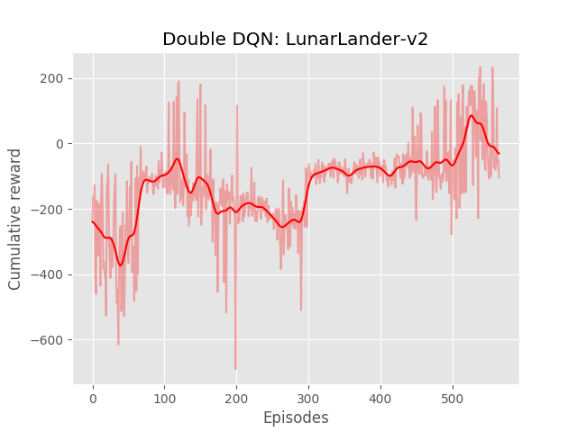
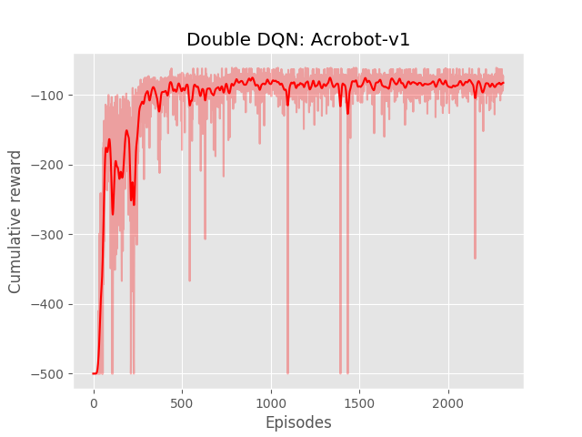

#Double Deep Q-Learning 

This repo holds an implementation of a PyTorch version of Double Deep Q-Learning. I tried to make this implementation as clear and minimal as possible. 
Given that I plan to use it on environments in which the state is only a vector (not an image), the implementation doesn't cover the pre-processing of an image nor does it use the frame stacking wrappers that usually goes with the Atari games. 

Anyway, it performs well enough on environments such as `Acrobot-v1` and `LunarLander-v2` and may be a good starting point for anyone who wishes to improve on it. 

## How to use: 

To train an agent, run: 

```bash
python double_dqn.py --env LunarLander-v2
```

To see the agent perform: 
```bash
python enjoy.py --env LunarLander-v2
```

## Performances




